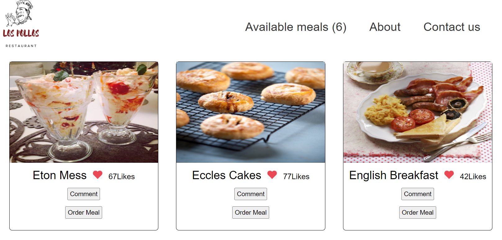
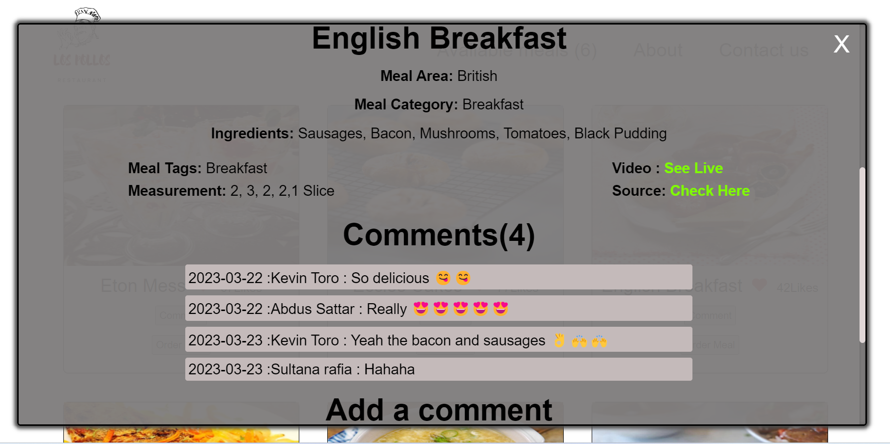

<a name="readme-top"></a>

<div align="center">
 <h3><b>Javascript-Capstone </b>.
 </h5>
</div>

<div align="center">
<h3><b>screenshot</b></h3>


</div>

<!-- TABLE OF CONTENTS -->

# 📗 Table of Contents

- [📖 About the Project](#about-project)
  - [🛠 Built With](#built-with)
    - [Tech Stack](#tech-stack)
    - [Key Features](#key-features)
  - [🚀 Live Demo and presentation video](#live-demo)
- [💻 Getting Started](#getting-started)
  - [Setup](#setup)
  - [Prerequisites](#prerequisites)
  - [Install](#install)
  - [Usage](#usage)
  - [Run tests](#run-tests)
  - [Deployment](#triangular_flag_on_post-deployment)
- [👥 Authors](#authors)
- [🔭 Future Features](#future-features)
- [🤝 Contributing](#contributing)
- [⭐️ Show your support](#support)
- [🙏 Acknowledgements](#acknowledgements)
- [📝 License](#license)

<!-- PROJECT DESCRIPTION -->

## 📖 Javascript-Capstone <a name="about-project"></a>

**Javascript-Capstone** is a project for learning Gitflows, GitHub workflows, and usage of API and SPA</b>

<h5> It has two main parts Homepage and Comments modal. Thanks ❤️ to my coding partner <b> Kevin Toro </b> for contributing to creating such an amazing-looking UI<b> In this project, we have used JS, HTML, CSS, webpack, and API for making a demo restaurant. It will allow users to make comments and likes and It will save on the Involvement API. In addition, we also followed the AAA pattern for testing suggested functions.

## 🛠 Built With <a name="built-with"></a>

## Tech Stack <a name="tech-stack"></a>

<details>
  <summary>Client</summary>
  <b>This project only works client side right now.</b>
  <ul>
    <li>HTML</li>
    <li>CSS</li>
    <li>JS</li>
    <li>webpack</li>
  </ul>
</details>
<details>
  <summary>Server</summary>
  <ul>
    <li><a href=#>Local Server - Hosted on Github</a></li>
  </ul>
</details>

<details>
<summary>Database</summary>
  <ul>
    <li><a href=#>API's used</a></li>
  </ul>
</details>

<!-- Features -->

# 💻 Key Features <a name="key-features"></a>

## Home page:
- When the page loads, the webapp retrieves data from:
- The selected API and shows the list of items on screen.
- The Involvement API to show the item likes.
- The page should make only 2 requests:
- One to the base API.
- One to the Involvement API.
- When the user clicks on the Like button of an item, the interaction is recorded in the Involvement API and the screen is updated.
- Home page header and navigation similar to the given mockup.
- Home page footer similar to the given mockup.
## Comments popup:
- When the popup loads, the webapp retrieves data from:
- The selected API and shows details about the selected item.
- The Involvement API to show the item comments.
- When the user clicks on the "Comment" button, the data is recorded in the Involvement API and the screen is updated.

<p align="right">(<a href="#readme-top">back to top</a>)</p>

<!-- LIVE DEMO -->

## 🚀 Live Demo and Project presentation video<a name="live-demo"></a>

- [Live Demo Link](https://abdussattar-70.github.io/Javascript-Capstone/dist)
- [Project presentation video](https://drive.google.com/file/d/1kaYJMSJTVw_1eVmV7t0yXi16nr7BfXx0/view?usp=sharing)

<p align="right">(<a href="#readme-top">back to top</a>)</p>

<!-- GETTING STARTED -->

## 💻 Getting Started <a name="getting-started"></a>

To get a local copy up and running, follow these steps.

## Prerequisites <a name="prerequisites"></a>

- In order to run this project you need:

### It would be best if you had some familiarity with `HTML`, `CSS`, and `JS`.

- A Computer (MAC or PC)
- code editor (VSCode,Atom etc...)
- A browser (Chrome,Mozilla,Safari etc...)
- Version Control System (Git and Github)

# Setup <a name="setup"></a>

Clone this repository to your desired folder:

```bash
       git clone https://github.com/AbdusSattar-70/Javascript-Capstone.git
       cd Javascript-Capstone
```

# Install <a name="install"></a>

Install this project with:

```bash
     npm install
```

# Run tests and check errors <a name="run-tests"></a>

To run tests and check errors, run the following command:

- To Test:-

```bash
   npm test
```
- To check Styelint error:-

```bash
   npx stylelint "\*_/_.{css,scss}"
```

- To check Eslint error:-

```bash
  npx exlint .
```

- To check webhint error:-

```bash
  npx hint .
```

# Deployment <a name="triangular_flag_on_post-deployment"></a>

You can deploy this project using:

```bash
   npm run build
```

<p align="right">(<a href="#readme-top">back to top</a>)</p>

<!-- AUTHORS -->

## 👥 Authors <a name="authors"></a>

## 👤 Abdus Sattar

- GitHub: [AbdusSattar-70](https://github.com/AbdusSattar-70)
- Twitter: [Abdus Sattar](https://twitter.com/Abdus_Sattar70)
- LinkedIn: [Abdus Sattar](https://www.linkedin.com/in/abdus-sattar-a41a26215/)

## 👤 Kevin Toro

- GitHub: [@torobucii](https://github.com/torobucii)
- Twitter: [@torobucii](https://twitter.com/@torobucii)
- LinkedIn: [Kevin Toro](https://linkedin.com/in/KevinToro)

<p align="right">(<a href="#readme-top">back to top</a>)</p>

<!-- FUTURE FEATURES -->

## 🔭 Future Features <a name="future-features"></a>

- [ ] **Web Responsiveness for all users**
- [ ] **Add web accessibility**
- [ ] **Add gradient background that will change randomly**

<p align="right">(<a href="#readme-top">back to top</a>)</p>

<!-- CONTRIBUTING -->

## 🤝 Contributing <a name="contributing"></a>

Everybody is welcome to suggest, changes,Contributions, issues, and feature request in this project.

In order to do it, fork this repository, create a new branch and open a Pull Request from your branch.

Feel free to check the [issues page](../../issues/).

<p align="right">(<a href="#readme-top">back to top</a>)</p>

<!-- SUPPORT -->

## ⭐️ Show your support <a name="support"></a>

If you like this project, Please give me ⭐️ and you can use it following [MIT](./LICENSE) license.

<p align="right">(<a href="#readme-top">back to top</a>)</p>

<!-- ACKNOWLEDGEMENTS -->

## 🙏 Acknowledgments <a name="acknowledgements"></a>

Thanks ❤️ to my coding partner <b> @torobucci</b> for contributing to creating the project.

I would like to thank and appreciate who contributes this project.

<p align="right">(<a href="#readme-top">back to top</a>)</p>

<!-- LICENSE -->

## 📝 License <a name="license"></a>

This project is under [MIT](./LICENSE) licensed.

<p align="right">(<a href="#readme-top">back to top</a>)</p>
